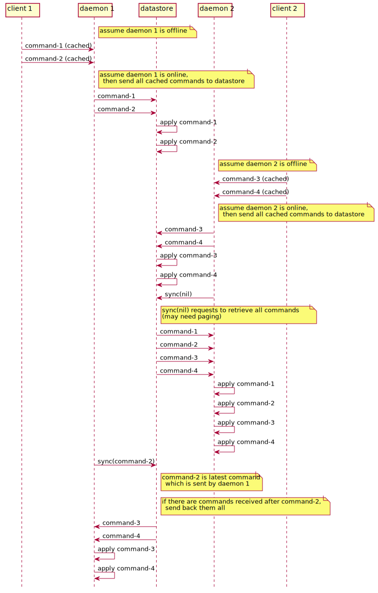

# daemon

## overview

* daemon has responsibility for
  * receive requests from front end
  * caches requests for working without network
  * send local updates to datastore
  * receive latest status from datastore 
  * notify updates to front end

## cache mechanism

* daemon has a database to store current status of tasks.
* daemon and datastore has "synced at", that represents when the daemon synced with datastore.
* periodically, daemon tries to perform syncing local data with datastore. 
  * daemon retrieves "synced at" from datastore and compare with daemon's.
  * if daemon's one is newer, daemon sends local updates they are occurred after the "synced at" (calls "up sync").
  * if datastore's one is newer, daemon retrieves updates from datastore they are occurred after the "synced at" (calls "down sync").
  * if they are same, syncing is not performed, but both "synced at" are updated to current date/time.

## sync with datastore

* daemon applies local updates to datastore.
  * before performing update, daemon confirms datastore's "synced at".
    * if daemon's is older, perform "down sync".
    * there's possibility that some part of local update may be discarded (overwritten by datastore's) by "down sync".
  * last update of local database is newer than "synced at", then daemon performs "up sync".
  * if network is not available (or failed to do "up sync"), the syncing is postponed until the network works again.

