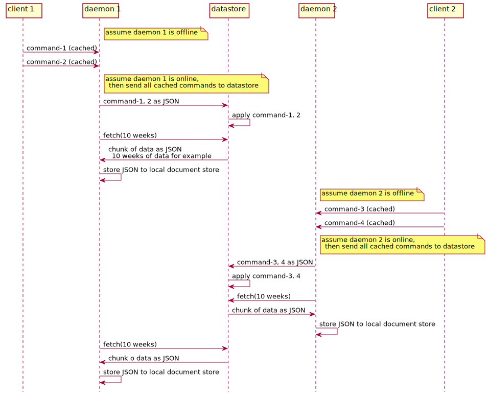
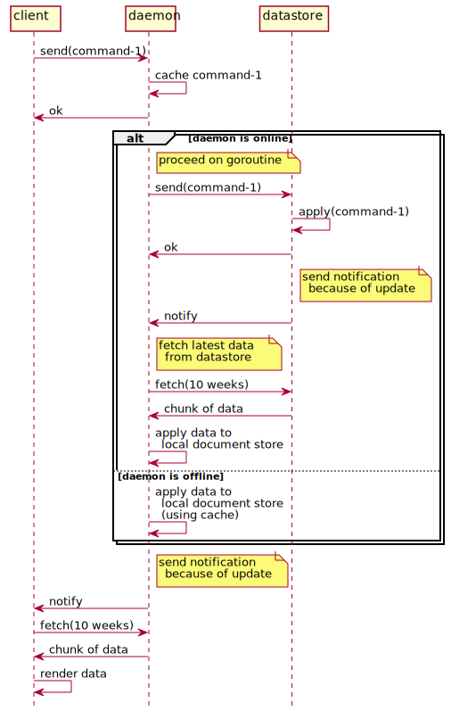

# daemon

## overview

* Daemon has responsibility for
  * Receive requests from front end.
  * Caches commands and reflect them to local document store for working without network.
  * Send chunk of commands to datastore for syncing.
  * Receive chunk of data to sync with datastore.

## sync with datastore

* Daemon has a document store to cache commands from front end, and store data from datastore.
* Periodically, daemon tries to perform syncing local data with datastore.
  * Send local commands, that are "not synced yet", to datastore.
  * Retrieve chunk of data. They are JSON formatted and represent "1 week of data", for example.
  * Daemon stores 10 weeks of data in local document store.

## gRPC API

* Hashira Service
  * send(array of command)
    * sends specified commands. 
  * retrieve(from, to (number of weeks)) array of task
    * returns array of task with specified term.

## command handling

* When daemon receives commands, cache them and return ok immediately.
* If daemon is online, send cached commands to datastore.
* When datastore receives commands and succeed to apply them, datastore sends notification to daemon.
* At daemon receiving notification, retrieve chunk of data from datastore for syncing.
* When daemon succeed to apply them, daemon sends notification to front end.
* At front end receiving notification, retrieve chunk of data from daemon.
* When front end succeed to retrieve chunk of data, render them.

* If daemon is offline, postpone to send commands to datastore.
  * Instead, daemon applies the cached commands to local document store,
  and send notification to front end as same as written above.

