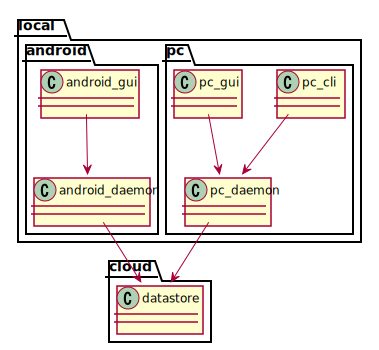

# design overview

## functions of hashira on PC

### cli and gui

* add a new task and place it on Backlog
* change status of tasks to ToDo, Doing, and Done
* add interrupter task, place it on Doing directory
* show list of tasks on each status

### gui specific

* show chart to indicate how long time spent to current task 

## functions of hashira on Android

### application

* add a new task and place it on Backlog
* change status of tasks to ToDo, Doing, and Done
* add interrupter task, place it on Doing directory
* show list of tasks on each status

### widget

* add a new task and place it on Backlog
* show list of tasks on Backlog
* show current task and how long time spent to the task

## functions of daemon

* it is for making hashira work even there's no network
* daemon has database (or kvs) to cache the tasks
* if network is available, then sync registered or changed tasks with cloud

## functions of datastore

* it is placed on cloud. it is for syncing data between devices
* accept requests to add or modify tasks
* in case some update is applied to tasks, push such information to each daemon

## modules

