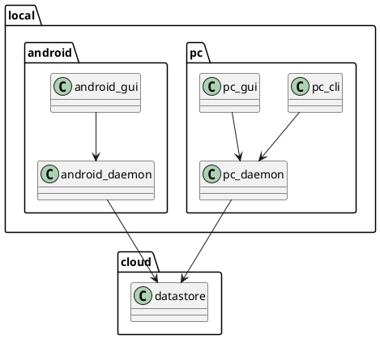

# hashira Design overview

## Functions of hashira on PC

### CLI and GUI

- Add a new task and place it on Backlog
- Change status of tasks to ToDo, Doing, and Done
- Add interrupter task, place it on Doing directory
- Show list of tasks on each status

### GUI specific

- Show chart to indicate how long time spent to current task

## Functions of hashira on Android

### Application

- Add a new task and place it on Backlog
- Change status of tasks to ToDo, Doing, and Done
- Add interrupter task, place it on Doing directory
- Show list of tasks on each status

### Widget

- Add a new task and place it on Backlog
- Show list of tasks on Backlog
- Show current task and how long time spent to the task

## Functions of Daemon

- It is for making hashira work even there's no network
- Daemon has database to cache the tasks and "commands"
  - "commands" means a unit of modifications to tasks.
    e.g) Add new task, move task to ToDo, and so on
  - "commands" are used to sync with datastore
- If network is available, then sync registered or changed tasks with cloud

## Functions of datastore

- It is assumed to place on cloud. it is for syncing data between devices
- It accepts "commands" to add or modify tasks
- Daemon can retrieve chunk of commands with from-to query to reflect datastore's update to local database

## Modules

