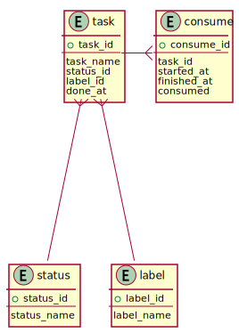

# database tables

## task

| column    | type   | remarks                       |
|-----------|--------|-------------------------------|
| task_id   | number | primary key, non-null, unique |
| task_name | string | non-null                      |
| status_id | number | non-null                      | 
| label_id  | number | non-null                      | 
| done_at   | time   | non-null                      | 

* task represents tasks and its status.

## status

| column      | type   | remarks                       |
|-------------|--------|-------------------------------|
| status_id   | number | primary key, non-null, unique |
| status_name | string | non-null, unique              |

* status represents task's status. like "Backlog", "ToDo", "Doing" and "Done" will be inserted here.

## consume

| column      | type   | remarks                       |
|-------------|--------|-------------------------------|
| consume_id  | number | primary key, non-null, unique |
| task_id     | number | non-null                      |
| started_at  | time   | non-null                      | 
| finished_at | time   | non-null                      | 
| consumed    | time   | non-null                      | 

* consume represents how many times are consumed for specified task.

## label

| column     | type   | remarks                       |
|------------|--------|-------------------------------|
| label_id   | number | primary key, non-null, unique |
| label_name | string | non-null                      |

* label represents task's label. this is used to task classification.

## ER diagram

